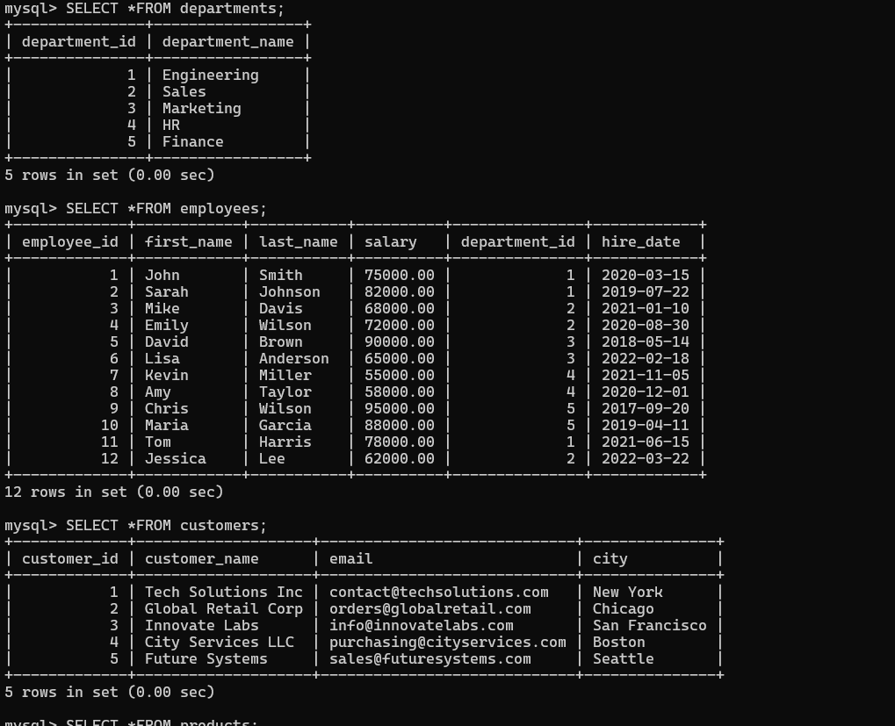
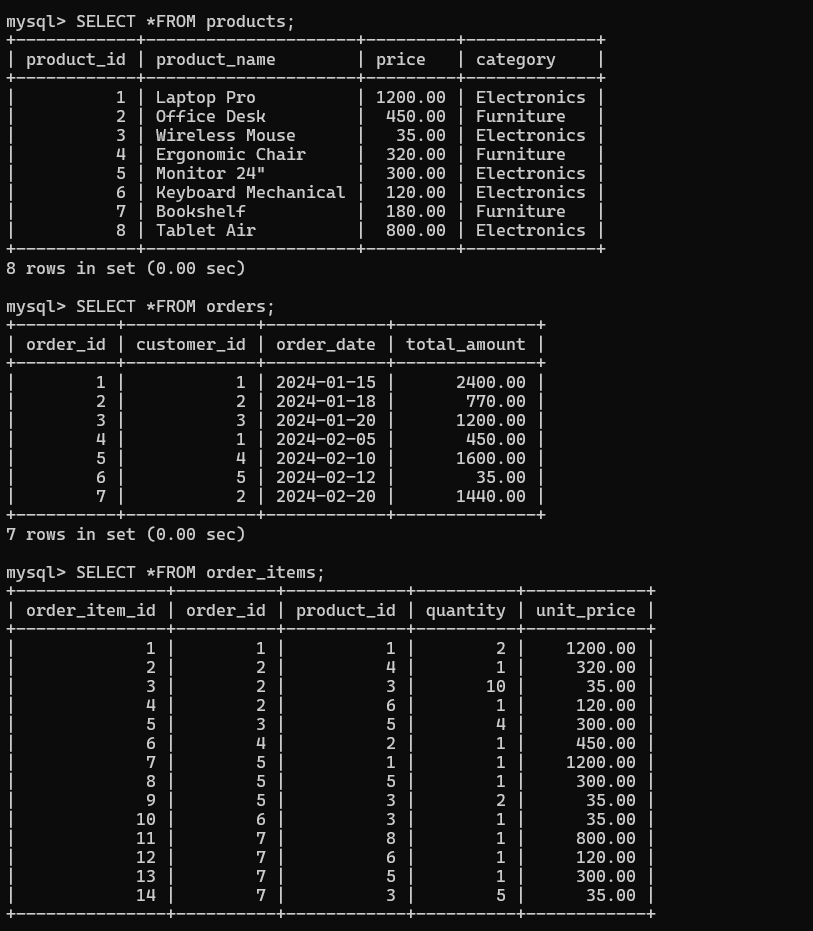

# 🏢 Company Database – Subqueries & Nested Queries Project

## 1. Introduction  
This project demonstrates **SQL subqueries and nested queries** using a **Company Database**.  
It covers:  
- Scalar subqueries  
- Subqueries with `IN`  
- Correlated subqueries with `EXISTS`  
- Subqueries in `FROM` clause  
- Multiple subqueries with comparison operators  
- Complex correlated subqueries  

The database stores information about **departments, employees, customers, products, and orders**.

---

## 2. Database Setup

### 📑 Database & Tables
```sql
CREATE TABLE departments (
    department_id INTEGER PRIMARY KEY,
    department_name VARCHAR(50) NOT NULL
);

CREATE TABLE employees (
    employee_id INTEGER PRIMARY KEY,
    first_name VARCHAR(50) NOT NULL,
    last_name VARCHAR(50) NOT NULL,
    salary DECIMAL(10,2) NOT NULL,
    department_id INTEGER,
    hire_date DATE,
    FOREIGN KEY (department_id) REFERENCES departments(department_id)
);

CREATE TABLE customers (
    customer_id INTEGER PRIMARY KEY,
    customer_name VARCHAR(100) NOT NULL,
    email VARCHAR(100),
    city VARCHAR(50)
);

CREATE TABLE products (
    product_id INTEGER PRIMARY KEY,
    product_name VARCHAR(100) NOT NULL,
    price DECIMAL(10,2) NOT NULL,
    category VARCHAR(50)
);

CREATE TABLE orders (
    order_id INTEGER PRIMARY KEY,
    customer_id INTEGER,
    order_date DATE,
    total_amount DECIMAL(10,2),
    FOREIGN KEY (customer_id) REFERENCES customers(customer_id)
);

CREATE TABLE order_items (
    order_item_id INTEGER PRIMARY KEY,
    order_id INTEGER,
    product_id INTEGER,
    quantity INTEGER NOT NULL,
    unit_price DECIMAL(10,2),
    FOREIGN KEY (order_id) REFERENCES orders(order_id),
    FOREIGN KEY (product_id) REFERENCES products(product_id)
);
```

---

## 3. Insert Sample Data

### Departments
```sql
INSERT INTO departments (department_id, department_name) VALUES
(1, 'Engineering'),
(2, 'Sales'),
(3, 'Marketing'),
(4, 'HR'),
(5, 'Finance');
```

### Employees
```sql
INSERT INTO employees (employee_id, first_name, last_name, salary, department_id, hire_date) VALUES
(1, 'John', 'Smith', 75000, 1, '2020-03-15'),
(2, 'Sarah', 'Johnson', 82000, 1, '2019-07-22'),
(3, 'Mike', 'Davis', 68000, 2, '2021-01-10'),
(4, 'Emily', 'Wilson', 72000, 2, '2020-08-30'),
(5, 'David', 'Brown', 90000, 3, '2018-05-14'),
(6, 'Lisa', 'Anderson', 65000, 3, '2022-02-18'),
(7, 'Kevin', 'Miller', 55000, 4, '2021-11-05'),
(8, 'Amy', 'Taylor', 58000, 4, '2020-12-01'),
(9, 'Chris', 'Wilson', 95000, 5, '2017-09-20'),
(10, 'Maria', 'Garcia', 88000, 5, '2019-04-11'),
(11, 'Tom', 'Harris', 78000, 1, '2021-06-15'),
(12, 'Jessica', 'Lee', 62000, 2, '2022-03-22');
```

### Customers
```sql
INSERT INTO customers (customer_id, customer_name, email, city) VALUES
(1, 'Tech Solutions Inc', 'contact@techsolutions.com', 'New York'),
(2, 'Global Retail Corp', 'orders@globalretail.com', 'Chicago'),
(3, 'Innovate Labs', 'info@innovatelabs.com', 'San Francisco'),
(4, 'City Services LLC', 'purchasing@cityservices.com', 'Boston'),
(5, 'Future Systems', 'sales@futuresystems.com', 'Seattle');
```

### Products
```sql
INSERT INTO products (product_id, product_name, price, category) VALUES
(1, 'Laptop Pro', 1200.00, 'Electronics'),
(2, 'Office Desk', 450.00, 'Furniture'),
(3, 'Wireless Mouse', 35.00, 'Electronics'),
(4, 'Ergonomic Chair', 320.00, 'Furniture'),
(5, 'Monitor 24"', 300.00, 'Electronics'),
(6, 'Keyboard Mechanical', 120.00, 'Electronics'),
(7, 'Bookshelf', 180.00, 'Furniture'),
(8, 'Tablet Air', 800.00, 'Electronics');
```

### Orders
```sql
INSERT INTO orders (order_id, customer_id, order_date, total_amount) VALUES
(1, 1, '2024-01-15', 2400.00),
(2, 2, '2024-01-18', 770.00),
(3, 3, '2024-01-20', 1200.00),
(4, 1, '2024-02-05', 450.00),
(5, 4, '2024-02-10', 1600.00),
(6, 5, '2024-02-12', 35.00),
(7, 2, '2024-02-20', 1440.00);
```

### Order Items
```sql
INSERT INTO order_items (order_item_id, order_id, product_id, quantity, unit_price) VALUES
(1, 1, 1, 2, 1200.00),
(2, 2, 4, 1, 320.00),
(3, 2, 3, 10, 35.00),
(4, 2, 6, 1, 120.00),
(5, 3, 5, 4, 300.00),
(6, 4, 2, 1, 450.00),
(7, 5, 1, 1, 1200.00),
(8, 5, 5, 1, 300.00),
(9, 5, 3, 2, 35.00),
(10, 6, 3, 1, 35.00),
(11, 7, 8, 1, 800.00),
(12, 7, 6, 1, 120.00),
(13, 7, 5, 1, 300.00),
(14, 7, 3, 5, 35.00);
```



---

## 4. SQL Queries and Explanations

### Query 1: Scalar Subquery in SELECT
```sql
SELECT e.employee_id, e.first_name, e.last_name, e.salary, d.department_name,
       (SELECT AVG(salary) FROM employees e2 WHERE e2.department_id = e.department_id) as avg_department_salary
FROM employees e
JOIN departments d ON e.department_id = d.department_id
WHERE e.salary > (SELECT AVG(salary) FROM employees e2 WHERE e2.department_id = e.department_id);
```
**Explanation:** Finds employees earning more than the average salary in their department.

**Output Example:**  
| employee_id | first_name | last_name | salary | department_name | avg_department_salary |
|-------------|------------|-----------|--------|-----------------|-----------------------|
| 2 | Sarah | Johnson | 82000 | Engineering | 77666.67 |
| 4 | Emily | Wilson | 72000 | Sales | 65000 |
| 5 | David | Brown | 90000 | Marketing | 77500 |
| 8 | Amy | Taylor | 58000 | HR | 56500 |
| 9 | Chris | Wilson | 95000 | Finance | 91500 |

---

### Query 2: Subquery with IN Operator
```sql
SELECT customer_id, customer_name, email, city
FROM customers
WHERE customer_id IN (
    SELECT DISTINCT customer_id FROM orders WHERE strftime('%Y', order_date) = '2024'
);
```
**Explanation:** Finds customers who placed orders in 2024.

**Output Example:**  
| customer_id | customer_name | email | city |
|-------------|---------------|-------|------|
| 1 | Tech Solutions Inc | contact@techsolutions.com | New York |
| 2 | Global Retail Corp | orders@globalretail.com | Chicago |
| 3 | Innovate Labs | info@innovatelabs.com | San Francisco |
| 4 | City Services LLC | purchasing@cityservices.com | Boston |
| 5 | Future Systems | sales@futuresystems.com | Seattle |

---

### Query 3: Correlated Subquery with EXISTS
```sql
SELECT product_id, product_name, price, category
FROM products p
WHERE NOT EXISTS (SELECT 1 FROM order_items oi WHERE oi.product_id = p.product_id);
```
**Explanation:** Finds products that have never been ordered.

**Output Example:**  
| product_id | product_name | price | category |
|------------|--------------|-------|----------|
| 7 | Bookshelf | 180.00 | Furniture |

---

### Query 4: Subquery in FROM Clause
```sql
SELECT department_name, total_salary, employee_count
FROM (
    SELECT d.department_name, SUM(e.salary) as total_salary, COUNT(e.employee_id) as employee_count
    FROM departments d
    JOIN employees e ON d.department_id = e.department_id
    GROUP BY d.department_name
) dept_salaries
WHERE total_salary > (
    SELECT AVG(salary_sum)
    FROM (SELECT SUM(salary) as salary_sum FROM employees GROUP BY department_id) department_totals
);
```
**Explanation:** Finds departments with above-average salary expenditure.

**Output Example:**  
| department_name | total_salary | employee_count |
|-----------------|--------------|----------------|
| Engineering | 235000 | 3 |
| Finance | 183000 | 2 |

---

### Query 5: Multiple Subqueries with Comparison Operators
```sql
SELECT employee_id, first_name, last_name, salary, department_id
FROM employees
WHERE salary > (SELECT AVG(salary) FROM employees)
AND department_id IN (
    SELECT department_id FROM employees GROUP BY department_id
    HAVING AVG(salary) > (SELECT AVG(salary) FROM employees)
);
```
**Explanation:** Finds employees who earn more than the company average and work in high-performing departments.

**Output Example:**  
| employee_id | first_name | last_name | salary | department_id |
|-------------|------------|-----------|--------|---------------|
| 2 | Sarah | Johnson | 82000 | 1 |
| 5 | David | Brown | 90000 | 3 |
| 9 | Chris | Wilson | 95000 | 5 |
| 10 | Maria | Garcia | 88000 | 5 |

---

### Query 6: Complex Correlated Subquery
```sql
SELECT e1.employee_id, e1.first_name, e1.last_name, d.department_name, e1.salary
FROM employees e1
JOIN departments d ON e1.department_id = d.department_id
WHERE e1.salary = (SELECT MAX(e2.salary) FROM employees e2 WHERE e2.department_id = e1.department_id)
ORDER BY d.department_name;
```
**Explanation:** Finds the highest paid employee in each department.

**Output Example:**  
| employee_id | first_name | last_name | department_name | salary |
|-------------|------------|-----------|-----------------|--------|
| 2 | Sarah | Johnson | Engineering | 82000 |
| 4 | Emily | Wilson | Sales | 72000 |
| 5 | David | Brown | Marketing | 90000 |
| 7 | Kevin | Miller | HR | 55000 |
| 9 | Chris | Wilson | Finance | 95000 |

---

